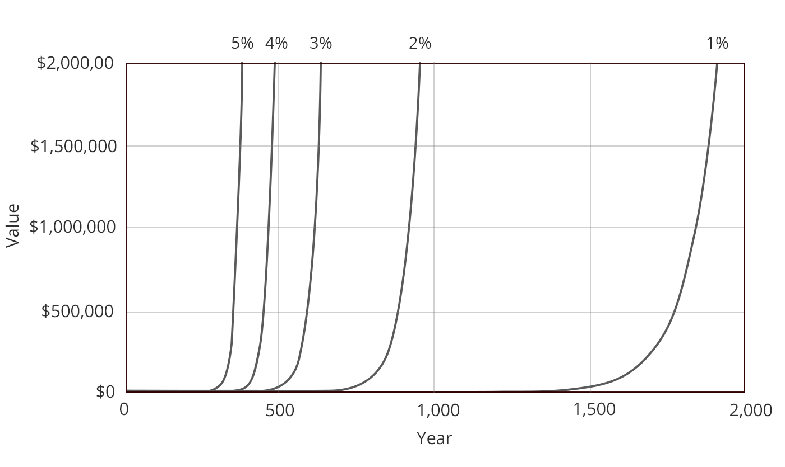
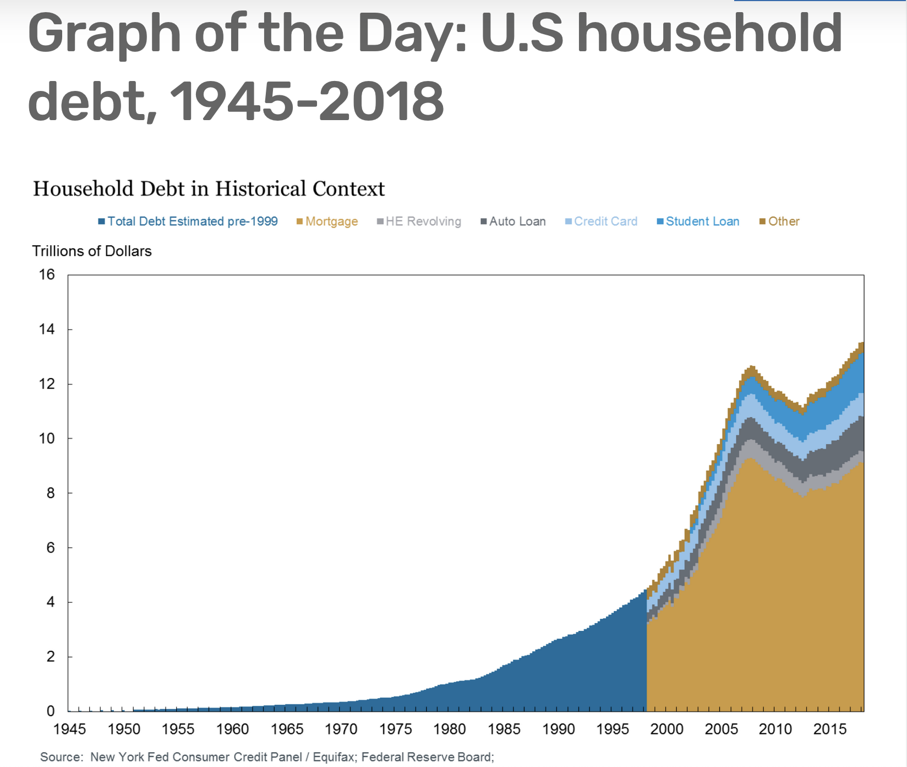
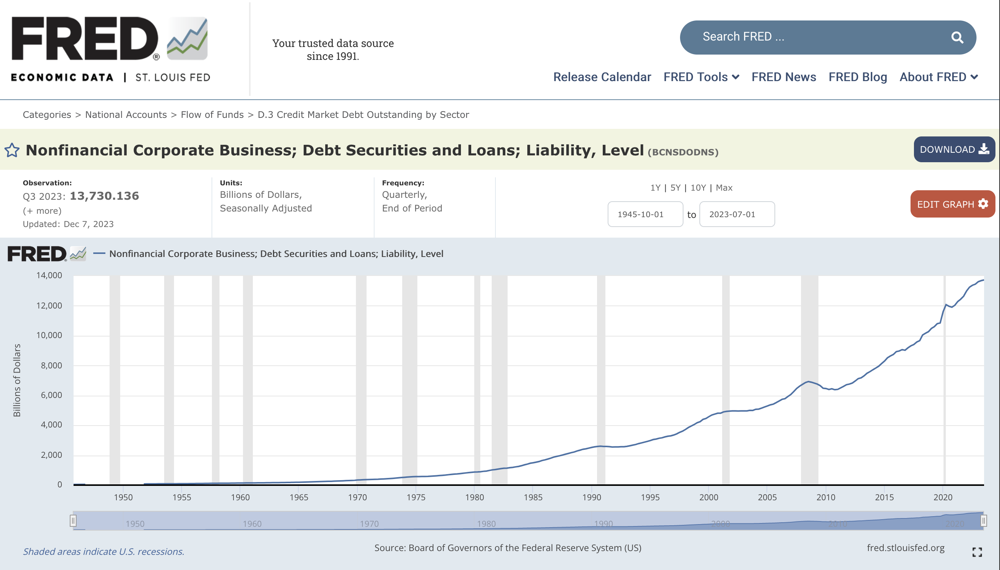
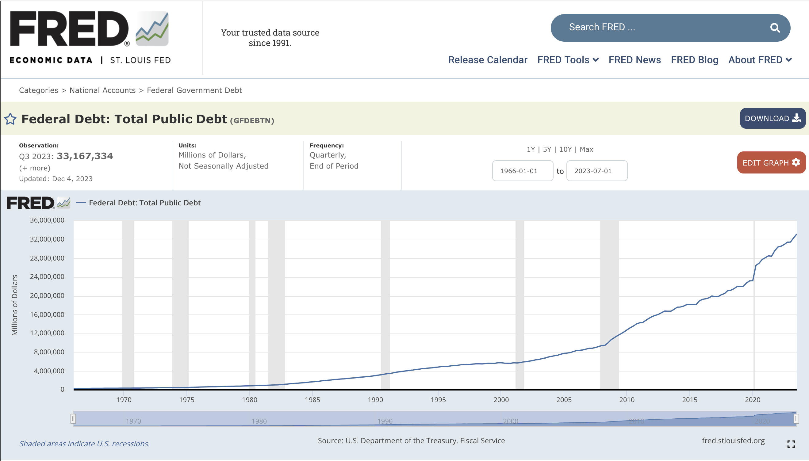

# Interest

Everyone understands that money grows through interest. We know that when one borrows money, they must repay not just the amount borrowed but an additional amount as well. We also know that when we lend money or deposit it in a savings account we are entitled not just to the amount lent/deposited but an additional amount that we call interest. But is this logical and natural?

When a squirrel sets aside nuts for the winter does he come back later and find more nuts? No, that never happens. In fact, the opposite happens. When a squirrel stores nuts, some of those nuts spoil due to exposure to the elements, some get eaten by insects, some get lost, some get stolen by other creatures. A store of nuts invariably loses value with the passage of time. And this is a nearly universal aspect of nature. We live in a universe characterised by increasing entropy. Physical matter tends to move from a state of greater order to a state of less order. Because of this law of nature, almost all forms of physical wealth lose value with the passage of time.

But money behaves in the exact opposite way. Why does money gain value with the passage of time when everything else loses value?

## **Compound interest**

It is easy to underestimate the significance of interest. People who don’t borrow or lend money generally think interest doesn’t affect them. This couldn’t be further from the truth. Interest is the circulatory principle of the blood of the economic organism. It affects virtually every aspect of the economy. It affects wages. It affects the prices of goods & services. It affects the availability and cost of housing. It makes ever-greater concentrations of wealth mathematically inevitable. It causes the boom & bust dynamic of the economy, and it’s the main driver of our constant pursuit of growth which puts us on a path toward environmental disaster.

In order to grasp the power of interest, consider the following:

* Invest 1 penny with 1% interest, compounded monthly, for 2000 years - $4.8 million
* Invest 1 penny with 2% interest, compounded monthly, for 2000 years - $2.3 quadrillion

At 1% the penny grows to enough to buy a nice apartment in New York City. At 2% it grows to enough to buy everything on earth five times. That’s the power of compound interest. Over long periods of time interest overwhelms everything. The growth of compound interest is an exponential mathematical function. And any exponential growth function eventually goes vertical if it continues unchecked. It eventually shoots toward infinity at an ever accelerating rate.

<figure><figcaption></figcaption></figure>

Here’s the growth curve of an investment of one penny at different percentages of interest. The lower the interest rate, the longer it takes to go vertical, but they all go vertical eventually, even at 1%. Unchecked exponential growth is completely at odds with the laws of nature. Nothing in nature grows that way. Bacteria or insects or rabbits might grow exponentially for a while, but eventually some limiting factor operates to stop the exponential growth. If this didn’t happen pretty soon bacteria, insects or rabbits would crowd out everything else on earth. But what limiting factor stops the growth of interest? Interest is a process that doesn’t follow the laws of nature, and Silvio Gesell says this is because interest is an artificial, man-made phenomenon.\
\

## Money creation via bank lending

Many people have an image in their minds of government printing presses churning out dollar bills. However that is not how most money actually gets created. For the most part, new money comes into existence when banks issue loans. When a bank makes a loan, they simply credit the amount of the loan to the borrower’s account and this act creates new money. It might not make sense, but that is the reality of how most money comes into existence in the existing fiat system.

When a bank makes a loan of $1,000, They credit the borrower’s account with $1,000. The borrower can now spend the $1,000 of new money that has been added to the money supply. Furthermore, this method of money creation means that more money creation is needed in the future. When a loan of $1,000 is made, $1,000 is created. However a future need for more than $1,000 results due to interest on the loan. That means more money will have to be created by issuing more loans in the future.

The dynamics of money creation through bank lending mean that scarcity is built into the system. There’s never enough money to satisfy all outstanding obligations, and this necessitates more and more lending. The creation of money through lending sets in motion a hamster wheel of loans financed by more loans, and this process continues without limit (or until the system collapses).

The nature of money creation through bank lending makes the growth of debt mathematically inevitable. It is not primarily a consequence of financial irresponsibility on the part of borrowers. It is an automatic consequence of the growth characteristics of interest. Remember, even at 1% the growth curve eventually goes vertical.

To illustrate this dynamic, let’s look at a few graphs. This first one is the total amount of household debt in the US from 1945 to 2018.

<figure><figcaption></figcaption></figure>

It starts from almost nothing and grows at a constantly accelerating rate up until around the time of the Great Financial Crisis in 2008, which temporarily stopped the steady upward trajectory, but it then resumed. This chart only goes to 2018. Since then, total household debt has surpassed $17 trillion, so if the chart was continued to the present the curve would have gone off the top of the chart.

<figure><figcaption></figcaption></figure>

This is the total corporate debt in the US over the same time period (although this one doesn’t stop in 2018).

<figure><figcaption></figcaption></figure>

This is the total US federal government debt from 1965 to the present.

It’s not simply that households, corporations and government all became more spendthrift or more “addicted to debt”. It’s that the growth of debt is a mathematical inevitability in a system where lending is the mechanism for the creation of money.

One of the foremost contemporary Gesellian scholars, Dr. Felix Fuders, a German economist who teaches at a university in Chile, makes the argument that the mathematical tendency of the money supply to constantly increase, due to the dynamics of interest and money creation via bank loans, is one of the main drivers of the so-called “growth imperative”, the constant pursuit of growth without regard to the environmental or social consequences.

Last year Felix published a book entitled How to Fulfil the UN Sustainability Goals: Rethinking the Role and Concept of Money in the Light of Sustainability, in which he makes the case that it is impossible to meaningfully address the problem of unsustainable growth without completely overhauling our monetary system along the lines proposed by Silvio Gesell.

## The definition of interest

Before we can analyse the phenomenon of interest, we must first define it properly. In the discussion that follows, the word is used in a more precise, narrow sense than how it is used in everyday conversation. For example, when someone takes out a car loan or a mortgage, the loan has an overall “interest rate”. But that rate actually consists of four distinct components, each of which serve different purposes and behave according to different principles. Not all of these components should be considered as “interest” if properly understood. The four components are:

* **Risk free interest** - So-called “pure” or “risk-free” interest is the part of the overall rate that is independent of the risk characteristics of the individual borrower, changes in the purchasing power of money and the administrative costs of issuing and servicing loans. This risk free interest, or “basic interest”, reflects the pure power of money to grow. The risk-free rate is usually approximated by using some standard interest rate on government debt. Since a government which borrows in its own currency can always create more of that currency if necessary in order to meet its obligations, there is no possibility of being forced into default.
* **Risk premium** - The second component of “interest” is the risk-premium. This is an additional amount which is added to the risk-free rate to reflect the credit risk of the specific borrower. A person with a poor credit history will pay a higher rate on a car loan than a person with good credit. Similarly, corporations with questionable finances and lower credit ratings will pay higher rates on their bonds than more financially stable companies. Since the risk-premium is different for each loan and depends on the characteristics of the individual borrower, it should not be thought of as something that stems from the nature of money itself.
* **Expected inflation or deflation** - The third component of “interest” is a measure of expected inflation or deflation. If the purchasing power of money changes over the course of a loan, the money used to repay the loan doesn’t have the same purchasing power as the money that was originally borrowed. If inflation has occurred over the course of a loan, the money used to repay the loan has less purchasing power than the money that was originally lent. This benefits the borrower at the expense of the lender. Deflation has the opposite effect, shifting wealth from the borrower to the lender. If the nominal interest rate on a loan is 8% and inflation over the course of the loan is 3%, the real rate (that is, the rate after adjusting for changes in the purchasing power of money) is 5%. So most real world interest rates include a component that reflects expected inflation or deflation. However, similar to the risk-premium, this factor stems from causes other than the nature of money itself and therefore should not be thought of as interest when properly understood.
* **Administrative costs** - And the fourth component of “interest” is administrative costs. The issuer of loans has to employ people to evaluate loan applications, collect and process payments, pursue recourse for non-payment, etc. Those people need to be paid for these efforts. As with the second and third components, administrative costs have nothing to do with the nature of money and should not be thought of as interest.

Therefore, in order to use a term that has a clear, logically rigorous definition and that describes the nature of money itself, only the first component, so-called “pure” interest, should be included in the definition. The analysis that follows is based on this narrower definition. It is important to keep in mind that this is at odds with how the word is understood in everyday use. So, for example, when we arrive at Gesell’s conclusion that interest should not exist, many people reflexively object that if lenders are not compensated for risk they would never lend to less creditworthy borrowers. This is obviously true, but that component of a lending agreement does not represent interest when properly understood.

## **Theories of interest**

Interest is an economic phenomenon that has existed for thousands of years. It has been analysed not just by economists but by philosophers and the world’s major religions. From Aristotle to Silvio Gesell, from Judaism to Islam, interest has been a controversial subject that has been debated for thousands of years. Nevertheless, there is still no consensus regarding why interest exists. Many theories have been proposed over the centuries.

**Abstinence theory**

Abstinence theory states that interest is a reward for postponing consumption, thereby making resources available to be used for production. This theory suggests that by choosing not to consume their wealth immediately, savers enable its use in productive activities, and that they need to be offered a reward in order to do so. Abstinence theory highlights the role of saving and deferred gratification in creating investment capital. Abstinence theory is related to another theory which is ascendant in modern, neoclassical economic thought – i.e. Time-preference Theory.

However, referring back to the example of a squirrel storing nuts, we find that Abstinence theory is completely at odds with the laws of nature. If one abstains from drinking a gallon of milk, does it increase in value? If one abstains from using a factory full of machinery and supplies, does one receive a reward for doing so? Does a warehouse full of inventory gain value with the passage of time? No, in all cases, the opposite happens. A gallon of milk, an idle factory and a warehouse of inventory all lose value with the passage of time.

Even gold, an exceptional form of matter that is immune to decay, still imposes the costs of storage and security on its owners. If you had your net worth in the form of gold stored in your house would you feel secure? Would you not feel the need to spend money on security systems and/or insurance? If so, that means the gold would generate negative, not positive, interest.

**Fructification theory**

Fructification theory says that the root cause of the phenomenon of interest is the fertility of nature. This view goes back to the late-18th century and the French economist Turgot. According to this view, a holder of money has a choice between lending that money or buying land, and since ownership of land entitles the owner to the wealth created by the productive forces of nature, people will not choose to lend money unless the return they are offered matches the return they can earn through land ownership.

Silvio Gesell argues that private ownership of land is an unnatural, irrational, unjust extension of the principle of private property which is actually at odds with that principle. Most economists agree that the basis of private property is human labour – i.e. “if you made it, you own it.” But who made land? How can private property rights over land be established on the basis of human labour? So the concept of Fructification would not apply under a Gesellian system in which all land was owned by the community. Furthermore, if Fructification was the cause of interest that would imply that interest would not exist if private land ownership did not also exist. The fact that interest has existed at times when private individuals could not own land indicates that while the productive forces of nature may be a contributory factor, they are clearly not the sole (or primary) cause of interest.

**Productivity theory**

Productivity theory says that since lenders provide borrowers with useful capital which increases the productivity of labour, lenders are therefore entitled to receive a portion of the additional wealth produced through the use of that capital. This is a superficially appealing argument as it’s true that labour is more productive when it has access to capital than without it. However the productivity theory only looks at one side of the picture. It takes no account of the fact that the lender of capital also benefits since the capital would have lost value over time if it was not put to productive use. Which side benefits more is by no means clear and depends on the specific circumstances. That being the case, it would be as reasonable to expect that interest should be negative (i.e. the lender benefits more and should therefore be willing to pay for those benefits) as that it should be positive.

**Time preference theory**

The Time-preference theory is associated with the Austrian school of economics and is based on the supposition that humans prefer present consumption to future consumption and therefore must be rewarded for postponing their consumption. According to this view, in the absence of interest, people would immediately consume everything they have thus making no resources available for capital investment. This posits a view of human nature whereby people are unthinking gluttons who would consume everything they have as soon as possible if they weren’t offered a reward for refraining from doing so.

While it is undoubtedly true that there are some people who go straight to the bar when they get their pay cheques and thus express a positive time-preference, is this kind of behaviour general enough to base a theory of interest upon it? What about the opposite tendency, that is, people in the prime of their lives who recognise that they won’t always have health and the ability to work and who want to provide for their old age? Do those people need to be rewarded for postponing consumption? In fact, aren’t there many people who would be willing to trade $100 of present consumption for $90 of consumption in retirement assuming no change in the price level, because the idea of being destitute in old age is a terrifying prospect. This attitude implies negative time-preference.

Which of these two descriptions of human nature is more generally accurate when applied to the population as a whole, spendthrifts running off to a bar to blow their pay cheque on booze, or people who want to be comfortable in old age and are therefore be willing to postpone consumption even if they don’t receive a reward for doing so?

**Real theory**

Contemporary, mainstream, neoclassical economics has developed what’s referred to as a “Real Theory” of interest, which is essentially a combination of the productivity and time-preference theories. This is the view that is taught in most university level economics courses. But if neither the Productivity Theory nor the Time-preference Theory are convincing on their own, why should a combination of the two be convincing?

**Gesellian theory of interest**

Silvio Gesell believed that interest has nothing to do with the laws of nature, the physical attributes of goods & services or human nature. Rather, he argued that interest is a consequence of our form of money. And since money is a creation of man, interest should also be understood as a man-made phenomenon. He furthermore believed that interest is a consequence of a fundamental design flaw in our existing form of money and that if we switched to a more rational, natural form of money interest would disappear.

In Gesell’s view, It is the difference in the storability of money in comparison with real goods & services that is the root cause of interest. Money can be stored without cost or loss. Real goods & services cannot. This confers an advantage on holders of money and enables them to extract what Gesell refers to as a “tribute” from producers of unstorable goods & services. Let’s listen to how Gesell describes this dynamic:

“Newsboys shout and run because their wares are unsaleable a few hours after production. The milkman's cart is provided with bells because he must make his sales to the hour and minute. The vegetable woman is the earliest riser of God's creatures; she awakens the sleeping cocks. The butcher cannot afford to oversleep himself or to close his shop during the Whitsun holidays, for in twenty four hours his wares would be on the verge of putrefaction. Bakers can sell their wares at the regular price only as long as the loaves are warm… The farmer who has ploughed out his potatoes and fears an early frost hurriedly collects them and as hurriedly brings them to market to take advantage of the fine weather and to save, as far as possible, the laborious loading and unloading of his cheap and heavy product… Or take wage earners, the ten thousand battalions of workmen. Are they not as hurried as the newsboy, the vegetable seller, the farmer? If they do not work, part of their assets, their capability to work, is lost with every beat of the pendulum. Thus the nature of wares, their transitoriness, arouses the majority of us every morning from sleep, spurs us to haste and forces us to appear at a given hour in the market. The possessor of wares is commanded by them, under threat of punishment, to seek the market, and the punishment is carried out by the wares themselves.”

“The only way in which an owner of wares can protect himself against such losses is to sell them. He is compelled by the nature of his property to offer it for sale. If he resists this impulsion he is punished, and the punishment is carried out by his property, by the wares in his possession… It must also be remembered that new wares are continually flowing into the market. A cow must be milked daily, a man without possessions is daily compelled by hunger to work. The offer of wares must therefore become larger and more urgent if sale is delayed. As a rule the most favourable time for the sale of a product is the moment it leaves the factory. The longer the sale is delayed, the less favourable the market conditions… The offer of a ware for sale depends, therefore, not upon the will of its possessor, but upon the ware itself… Supply cannot be postponed. Quite independently of the will of the possessor of wares, a supply of them must daily appear in the market. Whether the sun shines or the rain falls, whether political rumours alarm the exchanges, supply is always equal to the stock of wares. Supply remains equal to the stock of wares even if the prices of wares are unsatisfactory. Whether the price brings the producer gain or loss, the wares must be offered for sale — usually at once.”

But what about demand? Gesell continues: “The possessor of money holds demand like a hound on the leash and lets it slip at the quarry of his choice. Wares are the quarry of demand… Demand enters the market proudly confident of an easy victory; supply appears dejected like a beggar who expects more kicks than half pence. On the one hand impulsion, on the other hand freedom; and the two together, impulsion and freedom, determine price.”

“Suppose now that demand makes use of the freedom it enjoys and withdraws from the market. Supply must then, because of the impulsion to which it is subject, seek out demand, hasten to meet it and entice it back to the market by the offer of some special advantage. Demand, instant demand, is a necessity to supply, and demand knows of this necessity. Consequently demand can usually ask for, and obtain some special advantage from its privilege of being able to withdraw from the market. Is there any reason why the possessor of money should not ask for this reward? … A and B, separated by space and time, wish to exchange their wares, flour and pig iron, and for this purpose need the money in C’s possession. C can at once effect the exchange with his money, or he can delay, hinder or forbid the exchange; for his money gives him the freedom of choosing the time at which it shall take place. Is it not obvious that C will demand payment for this power, and that A and B must grant it in the form of a tribute on their flour and pig iron? If they refuse this tribute to money, money withdraws from the market. A and B must then retire without completing the sale and undertake the heavy cost of returning home with their unsold products. They will then suffer equally as producers and consumers; as producers because their wares deteriorate, and as consumers because they must do without the goods to obtain which they brought their products to the market. If instead of gold, C owned another product, tea, powder, salt, cattle… the characteristics of these medium of exchanges would deprive him of the power of postponing his demand; he would no longer be able to levy a tribute on other products.”

Gesell states that the power of money to grow has nothing to do with the productivity of capital. It has nothing to do with human’s preferring present consumption to future consumption. It has nothing to do with the productive forces of nature. Rather, it is a consequence of a distortion of the exchange process which is caused by the fact that instead of recognising that the sole legitimate function of money is to facilitate the exchange of goods & services, we made the irrational decision to design money so that it will also perform the store of value function. And, as a result of this irrational decision, we inadvertently created a medium of exchange that alters the level playing field on which exchange would take place in an economy composed only of goods & services. And interest is a measure of the distortion thereby created. It is a quantification of the amount of power that has been taken away from producers of goods and services and given to holders of money.
