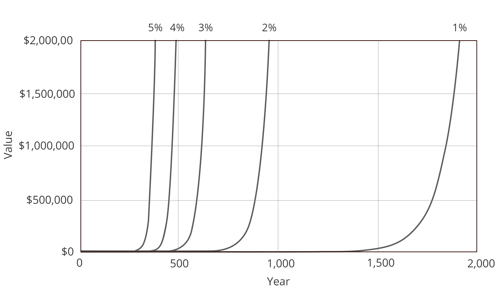
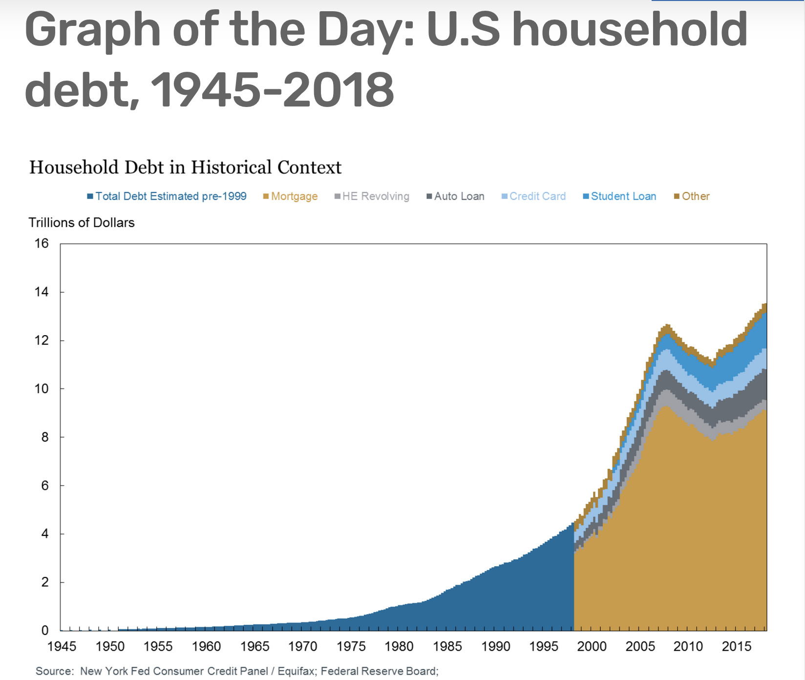
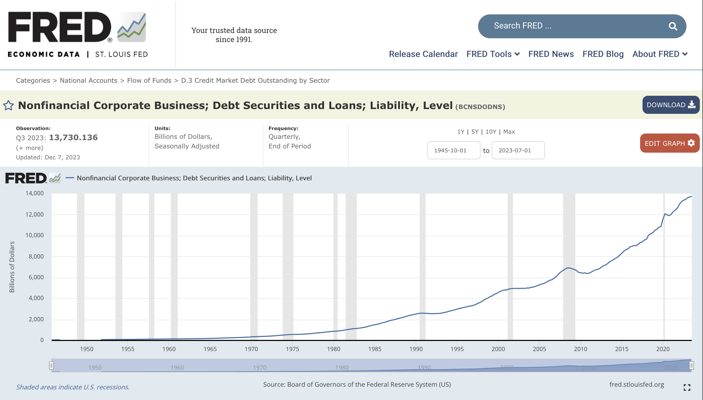
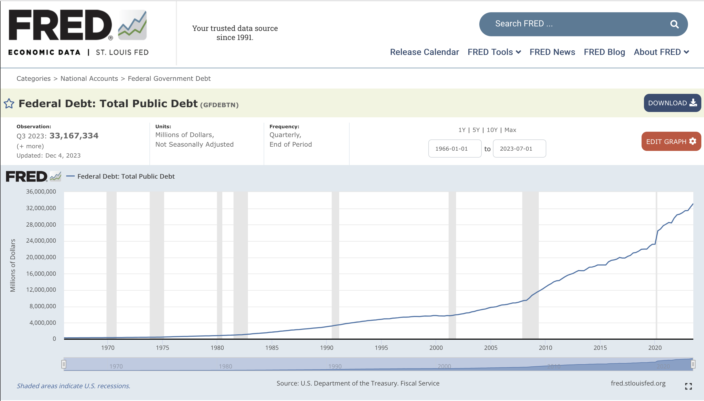

# Interest

Interest is commonly understood as the additional amount paid by a borrower to a lender in return for the temporary use of money. A borrower must usually repay more than the amount originally received, while a lender expects to recover the amount provided together with an additional return.

Interest is also associated with bank deposits, bonds and other financial arrangements. Someone who places money in an interest-bearing account expects their balance to increase over time. Money consequently appears to behave differently from most physical goods, which ordinarily deteriorate, become obsolete or impose costs on their owners.

When a squirrel stores nuts for the winter, it does not return to find that the quantity has increased. Some of the nuts may spoil, be eaten, become lost or be stolen. A store of physical goods generally loses value or imposes costs with the passage of time.

Money placed in an interest-bearing arrangement can behave in the opposite way. The monetary claim increases even though the holder has not added further money to it. This raises two related questions:

1. What does an observed interest rate actually represent?
2. Why does a return for lending money exist?

Before evaluating different theories of interest, it is necessary to define the term more precisely.

## The components of an interest rate

In ordinary conversation, the entire additional amount charged on a loan is described as interest. However, the rate on a real-world loan commonly consists of several components that perform different functions.

For the purposes of this analysis, an observed lending rate can be divided into four broad components:

1. Basic or risk-free interest
2. A risk premium
3. Expected inflation or deflation
4. Administrative costs.

Gesell’s objection concerned the first component. He did not argue that lenders should receive no compensation for the risk of loss, changes in purchasing power, administration or genuine financial services.

## Basic or risk-free interest

Basic interest is the underlying return available to a lender independently of the characteristics of a particular borrower, changes in purchasing power and the administrative cost of issuing the loan.

It is sometimes described as pure interest or risk-free interest. In practice, analysts often approximate it by looking at the return on highly secure government debt or other financial instruments considered to have very low default risk.

A government that borrows in a currency it issues is generally less exposed to involuntary nominal default than a private borrower because it can create additional units of that currency. Government debt may still be affected by inflation, policy decisions and changes in market confidence, but its rate is commonly used as a reference point for lower-risk lending.

For Gesell, this underlying return reflects the ability of money to command payment when its owner gives up liquidity. He referred to the monetary advantage from which it arises as basic or primeval interest.

## Risk premium

A risk premium compensates a lender for the possibility that the borrower will fail to meet the terms of the loan.

The risk is different for each borrower. A person with an unstable income or poor repayment history may be charged a higher rate than someone with a strong financial position. A financially uncertain corporation may have to offer a higher return on its bonds than a more stable company.

The risk premium does not arise merely from the nature of money. It reflects the circumstances of the borrower, the collateral provided, the terms of the agreement and the probability of loss.

Even if basic interest disappeared, lenders could still require compensation for genuine credit risk. A loan to a less creditworthy borrower would still justify a higher payment than a loan with little or no risk of default.

## Expected inflation or deflation

The purchasing power of money may change during the term of a loan.

If inflation occurs, the money used to repay the loan will purchase fewer goods and services than the money originally provided. This benefits the borrower relative to the lender because the debt is repaid with money of lower purchasing power.

Deflation has the opposite effect. If prices fall, the money used to repay the loan has greater purchasing power than the money originally borrowed. The real burden on the borrower increases, while the lender receives money that can purchase more.

Lenders and borrowers therefore consider expected changes in purchasing power when agreeing to a rate.

If a loan has a nominal rate of 8 per cent and inflation over the same period is 3 per cent, the approximate real rate is 5 per cent. The nominal rate is the rate stated in the contract, while the real rate adjusts for changes in purchasing power.

This inflation or deflation component does not represent basic interest in Gesell’s narrow definition. It compensates for an expected change in the value of the monetary unit during the loan.

## Administrative costs

Issuing and managing loans requires work and resources. A lender or financial institution may need to evaluate the borrower, prepare the agreement, maintain accounts and records, collect and process payments, monitor collateral, respond to missed payments or pursue recovery when an agreement is breached.

The people and systems performing these activities must be funded. Part of the rate or fees associated with a loan therefore compensates the provider for administration and genuine financial services.

These costs do not arise from the ability of money itself to generate a return. They are payments for labour, infrastructure and services.

## Interest in the narrow sense

When this analysis refers to Gesell’s claim that interest should disappear, it refers specifically to basic interest. It does not refer to the entire observed rate charged on every loan.

A lending arrangement could continue to include compensation for the probability of default, adjustments for expected inflation or deflation, payment for administration and payment for other genuine services.

This distinction is important. The statement that basic interest might disappear does not imply that every borrower should be able to obtain a loan at no cost. A risky and administratively complex loan could still require substantial compensation even if the underlying monetary component of interest were absent.

The question addressed by Gesell’s theory is narrower: why can an owner of comparatively secure and liquid money expect a return simply for surrendering control of it for a period?

## Theories of interest

Interest has existed in different forms for thousands of years. Economists, philosophers and religious traditions have proposed many explanations for why it arises and whether it is justified.

There is no single theory that has been accepted in every period or school of economic thought. The principal explanations considered here are abstinence theory, fructification theory, productivity theory, time-preference theory, the real theory of interest and Gesell’s monetary theory of interest.

## Abstinence theory

Abstinence theory describes interest as a reward for postponing consumption.

According to this theory, someone who possesses wealth has the option to consume it immediately. By choosing not to do so, the saver makes resources available for lending and productive investment. Interest provides compensation for this abstinence.

The theory highlights the relationship between saving and the formation of investment capital. If all income were consumed immediately, fewer resources would be available for equipment, infrastructure and other long-term productive activities.

Gesell’s objection was that abstinence alone does not normally cause physical wealth to increase. If someone refrains from drinking a quantity of milk, the milk does not become more valuable. It spoils. A factory that remains unused does not automatically generate a return. Its machinery may deteriorate or become obsolete. Inventory stored in a warehouse imposes costs and may lose value.

Even gold, which is resistant to physical decay, may require security, storage and insurance. Retaining physical wealth can therefore produce a negative return rather than a positive one.

From Gesell’s perspective, postponing consumption does not by itself explain why the owner of money should receive a positive return. It explains why resources might become available for future use, but it does not establish why the act of waiting must necessarily be rewarded.

## Fructification theory

Fructification theory connects interest to the productive capacity of nature.

This explanation is associated with the French economist Anne Robert Jacques Turgot. A person possessing money can use it to purchase productive land. Land may produce crops, rents or other forms of income. The money holder will therefore not lend the money unless the loan offers a return comparable to the income available from land ownership.

Under this theory, the return on land creates an opportunity cost for lending. Interest exists because the owner of money could instead use it to acquire a productive natural asset.

Gesell challenged this explanation through his criticism of private land ownership. He argued that land was not created by human labour and should therefore not be treated in the same way as goods produced by individuals. Under a system in which land was owned by the community, the private income available from acquiring land would operate differently.

He also argued that fructification could not be the sole cause of interest because lending and interest had existed under arrangements in which private ownership of land was restricted or absent.

The productive forces of nature may influence the returns available in an economy, but Gesell did not consider them the foundational cause of monetary interest.

## Productivity theory

Productivity theory explains interest through the productive use of capital.

A borrower may use a loan to purchase tools, machinery, buildings or other assets that increase the productivity of labour. Because access to capital enables the borrower to produce more wealth, the lender is considered entitled to receive part of the additional output.

This theory is initially persuasive because productive capital can clearly increase economic output. A worker using modern machinery can often produce much more than a worker relying only on manual labour.

Gesell argued that productivity theory considers only the benefit received by the borrower. The lender may also benefit because productive use can preserve an asset that would otherwise deteriorate or remain idle.

If machinery is lent to someone who uses and maintains it, the owner may benefit from avoiding the costs of inactivity. If goods are transferred to someone able to use them before they spoil or become obsolete, both parties may benefit.

Which participant benefits more depends on the circumstances. Productivity may justify sharing the output of a particular investment, but Gesell argued that it does not establish why money itself should always command a positive return.

Productive business arrangements could also take the form of shared ownership or profit-sharing rather than a predetermined monetary payment. The productivity of capital therefore does not, by itself, explain the existence of basic interest on money.

## Time-preference theory

Time-preference theory is associated particularly with the Austrian school of economics. It begins from the proposition that people generally prefer present consumption to future consumption.

Under this view, £100 available today is ordinarily considered more valuable than £100 available several years from now. Someone who gives up present control of money must therefore be compensated for waiting. Interest is the price that brings present and future preferences into balance.

Time-preference theory also argues that without a reward for postponing consumption, people would consume more of their present income and make fewer resources available for long-term investment.

Gesell questioned whether positive time preference describes human behaviour universally enough to explain interest.

Some people clearly prefer immediate consumption. Others deliberately sacrifice present consumption to prepare for old age, emergencies or future responsibilities. A person concerned about retirement might be willing to exchange £100 of present consumption for less than £100 of future consumption if doing so provides security.

This would represent negative rather than positive time preference. The person values future security enough to accept a cost for transferring purchasing power through time.

Gesell therefore argued that human preferences vary and cannot provide a complete explanation for a persistent, economy-wide rate of basic interest.

## The real theory of interest

Contemporary neoclassical economics commonly explains interest through a combination of productivity and time preference.

On the supply side, savers decide how much present consumption they are willing to postpone. On the demand side, borrowers and investors evaluate how productively the available capital can be used. The interest rate helps balance the supply of saving with the demand for investment.

This combined explanation is sometimes described as the real theory of interest because it locates the cause of interest in real economic factors which include preferences between present and future consumption, the productivity of capital, the availability of savings and the demand for investment.

Gesell rejected this approach because he did not accept either productivity or time preference as a sufficient explanation for basic interest. Combining the theories did not, in his view, resolve their underlying weaknesses.

His alternative was to locate the cause of basic interest in the characteristics of money itself.

## Gesell’s monetary theory of interest

Gesell argued that basic interest is not a consequence of natural fertility, the productivity of capital or a universal preference for present consumption. He described it as a consequence of the form of money adopted by society.

Money is a human institution created to facilitate exchange. Its characteristics are therefore not fixed by nature. If a particular form of money creates economic advantages for its holder, those advantages arise from the design of the monetary system.

The central feature in Gesell’s explanation is the difference between the storability of money and the storability of goods, services and labour.

Goods and productive assets normally impose costs on their owners. Food spoils, inventory requires storage, machinery becomes obsolete and buildings require maintenance. Labour that is not used today cannot generally be stored and sold tomorrow.

Money can often be retained at a lower cost. This gives its holder greater freedom to wait.

The owner of goods may be compelled to sell because delay produces a loss. The owner of money can withhold demand until favourable terms are offered. Gesell argued that this difference allows money to claim a payment as the condition for returning to circulation.

In his account, basic interest is that payment. It is the price the borrower or producer pays to persuade the money holder to surrender liquidity.

The power of money to earn basic interest therefore does not arise from the money producing new wealth by itself. It arises from the holder’s ability to delay exchange.

Gesell referred to the resulting return as a tribute that money can demand from goods. If the tribute is not available, money can remain outside the market while goods continue to deteriorate and sellers continue to incur costs.

Under this theory, basic interest measures the bargaining advantage that the monetary system gives to the holder of low-cost storable money.

## Compound interest

Compound interest means that interest is added to an existing balance and then becomes part of the amount on which future interest is calculated.

With simple interest, the additional return is calculated only on the original principal. With compound interest, the balance grows because returns are earned on both the original principal and the interest accumulated during earlier periods. This creates exponential rather than linear growth.

The significance of compounding can be difficult to perceive over short periods. Over long periods, even a low rate produces very large results.

Consider an initial investment of one penny:

* At 1 per cent annual interest, compounded monthly for 2,000 years, the balance grows to approximately $4.8 million.
* At 2 per cent annual interest, compounded monthly for 2,000 years, the balance grows to approximately $2.3 quadrillion.

The difference between 1 per cent and 2 per cent appears small, but the effect becomes enormous when the return compounds over a sufficiently long period.

<figure><figcaption></figcaption></figure>

The accompanying growth curves illustrate this exponential pattern. Higher rates become visibly steep sooner, but every positive compound rate eventually accelerates if it continues without interruption.

Physical and biological growth processes normally encounter limits. Populations of organisms may expand rapidly, but they are eventually constrained by food, space, disease and other environmental conditions.

Financial claims can continue compounding mathematically even when the underlying physical economy cannot grow at a corresponding rate. In practice, defaults, taxation, inflation, consumption, market losses and institutional change prevent individual monetary claims from expanding indefinitely. Nevertheless, compounding creates a persistent tendency for existing financial wealth to generate additional claims over time.

Gesell regarded this tendency as artificial rather than natural because it arises from monetary and contractual arrangements created by society.

## Money creation through bank lending

Most money in modern fiat economies does not exist as physical notes and coins. It exists as deposits recorded within the banking system.

Commercial banks create deposit money when they make loans. If a bank approves a loan of £1,000, it credits the borrower’s account with a deposit of £1,000. The borrower can then transfer or spend that deposit.

The act of lending creates:

* a £1,000 asset for the bank, representing the borrower’s obligation to repay; and
* a £1,000 deposit liability, representing the money available in the borrower’s account.

When the principal is repaid, the corresponding deposit money is removed from circulation. The borrower must also pay the financing charges associated with the loan, including interest and fees.

Banks do not create money without limits. Their lending is constrained by factors including capital requirements, liquidity, regulation, credit risk, the availability of creditworthy borrowers and the expected profitability of lending.

Nevertheless, bank lending remains a principal mechanism through which the quantity of deposit money expands and contracts.

## Interest and the demand for continued income

A loan creates a principal amount that the borrower can spend, while the lending agreement requires the borrower to repay the principal together with an additional amount.

The additional payment does not necessarily require a separate quantity of money to be created specifically for that individual loan. Existing money can circulate between participants and be used repeatedly, while banks spend part of their income on wages, operating costs, dividends and other expenses.

However, borrowers collectively require continuing income to meet both principal and financing payments. In a system where a large proportion of money is created through debt, economic activity, refinancing and new lending can become closely connected to the ability of existing borrowers to service their obligations.

Gesellian analysis places particular emphasis on this relationship. If money holders demand basic interest before making liquidity available, productive activities must generate returns above that monetary threshold. Borrowers must obtain enough income from the wider economy to meet the additional claims attached to their debts.

When debt and interest-bearing financial claims grow more quickly than the income available to service them, defaults, restructuring, inflation or further credit expansion may follow.

## Growth of debt

Household, corporate and government debt have all increased substantially over long periods in modern economies. The existing charts illustrate this rise in nominal debt across different sectors of the United States economy.

<figure><figcaption></figcaption></figure>

<figure><figcaption></figcaption></figure>

<figure><figcaption></figcaption></figure>

These graphs show the scale and direction of debt growth, but they should not be interpreted as demonstrating that interest is the sole cause. Nominal debt can also increase because of inflation, population growth, economic expansion, higher asset prices, changes in financial institutions, government spending and taxation decisions or greater use of formal credit.

Gesellian scholars argue that the structure of debt-based money creation and compound financial claims contributes to the persistent tendency for debt to expand. The need to service existing obligations can encourage continued borrowing, refinancing and economic growth.

Under this interpretation, rising debt is not simply the consequence of personal irresponsibility. It also reflects the institutional relationship between money creation, lending and interest-bearing obligations.

## Interest and the growth imperative

Felix Fuders and other contemporary Gesellian scholars connect interest-bearing debt to what they describe as a growth imperative.

If financial claims increase through compound interest, the income available to meet those claims must also increase, or some claims must be reduced through default, restructuring, taxation or inflation.

Businesses with debt obligations may need to expand revenue. Governments may seek continued economic growth to sustain tax income and service public debt. Households may depend on rising wages and asset values to manage long-term financial commitments.

From this perspective, the monetary system creates continuing pressure for economic output and income to expand.

Fuders argues that this pressure complicates efforts to achieve environmental sustainability. An economic system in which financial obligations require continuous expansion may conflict with ecological systems that cannot support unlimited material growth.

Gesell’s theory attributes this pressure ultimately to the ability of money to command basic interest. If low-cost monetary storability creates a minimum return that productive investment must exceed, then interest affects which investments proceed, how capital is allocated and how income is distributed.
