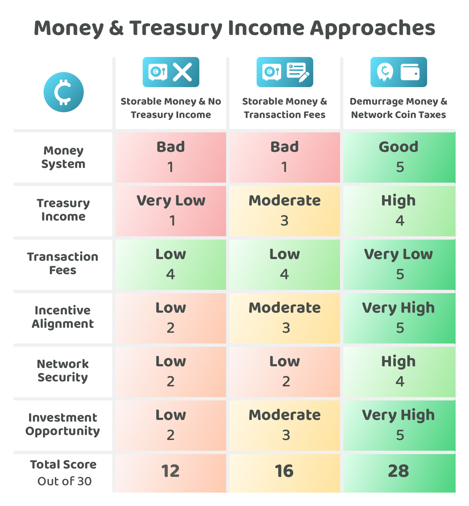

# Demurrage network money is inevitable

To make the case that demurrage is inevitable we need to compare some situations where a demurrage based Web3 ecosystem competes with alternative approaches for money and generating treasury income. Money is an integral part of the comparison as demurrage directly impacts the properties of the network coin as a form of money. Treasury income is the other main factor to consider, as if demurrage is implemented as a wealth tax it would be something that directly impacts how treasury income is generated. We’ll also need to consider how any of these differences impact transaction fees, network security, incentives and the attractiveness of investing in the network coin itself.

In regards to technology, if one ecosystem had better tech than the other it can be assumed that another ecosystem could emerge that duplicates the best technology in the market and then introduces the demurrage currency system. Web3 ecosystems, for the most part, are open source. So at a minimum you could expect that any competing demurrage based networks would have equal technical capabilities as other ecosystems over the long term. In reality a newer ecosystem could have some technical improvements over the existing networks. However for the sake of simplicity, these comparisons will assume the tech is the same across each network.

In regards to the network's funding process, all of these ecosystems could have adopted the same funding process. If one ecosystem identified an effective way to fund impactful initiatives it can be assumed that other ecosystems could also duplicate that approach. This factor of funding is only concerned with ecosystems that create circular economies by trying to generate treasury income. This income can then fund impactful initiatives over the long term. For the simplicity of this comparison, we will assume that each ecosystem has the same funding process.

## Money & treasury income approaches

To understand the benefits of demurrage we can compare the most common combination of approaches that a Web3 ecosystem might adopt when creating a money system and a process for generating treasury income. The approaches we will compare include:

* [**Hoardable money & no treasury income**](hoardable-money-and-no-treasury-income.md) - Creating a hoardable money with no mechanism for generating treasury income
* [**Hoardable money & transaction fees**](hoardable-money-and-transaction-fees.md) - Creating a hoardable money with a transaction fee model for generating treasury income
* [**Demurrage money & wealth taxes**](demurrage-money-and-wealth-taxes.md) - Creating a demurrage money using a wealth tax which is used to generate treasury income

<figure><figcaption></figcaption></figure>

**Key takeaways**

* **Demurrage is a better system for money** - As covered in the previous resources, demurrage represents a more effective approach for a system of money over hoardable money that causes wealth concentrations, economic stagnation and instability due to interest and money cycles.
* **Wealth taxes are the most effective for generating treasury income** - Wealth taxes generate more predictable and reliable income that is less impacted by changing transaction volume. To generate large amounts of income the network is reliant on network effects that are able to sustain higher wealth taxes.
* **Wealth taxes can reduce transaction fees more consistently to their lowest** - Wealth taxes can subsidise or fully pay for node operational costs which creates a long term solution for reducing transaction fees. Hoardable networks rely on transaction fees to pay for node operators which makes it more difficult to have transaction fees as low as they possibly can be as they need to predict how many transactions will be created to work out what the fee structure should be. This commonly means a buffer is needed to make sure the node operators are sufficiently compensated. With wealth taxes, it is easier to keep transaction fees as low as possible as the wealth tax income is more predictable and periodic.
* **Wealth taxes create the most aligned incentives** - All users that hold the coin will contribute towards the treasury through the wealth tax. The ecosystem also gets to focus on making transaction fees as low as possible which encourages the maximum amount of usage. Wealth taxes penalise hoarding which is the most undesirable use case. Increased transaction fees punish active users, the most important use case of the network. Wealth taxes are more egalitarian and effective at aligning the incentives.
* **Wealth taxes can lead to improved network security** - Users are incentivised to use their coins productively rather than hoard them, resulting in more exchange and investment. Demurrage helps to maximise coin velocity and opportunities for people to receive money for goods and services. Demurrage can help to ensure that money is not the end goal in the economy, which increases coin dispersion and decentralisation of the coin. Reducing the concentration of wealth should help with maintaining higher levels of network security as the influence that people have from the network coin would be reduced due to higher coin dispersion across the network. A balance still needs to be struck between having enough demand for network money so it is valuable but not too valuable that everyone tries to hoard it.
* **Wealth taxes create the best investment opportunities** - Wealth taxes create reliable and predictable treasury income. If the network has a lot of growth potential this treasury income can help with funding impactful initiatives that improve the network or that increase the number of protocols, applications and use cases available. A wealth tax can create a reliable growth engine for funding ongoing development efforts. Reliable funding can make it easier for a network to outcompete the other less funded and potentially stagnant networks. The ongoing development efforts and network improvements could lead to a larger amount of network growth and coin price appreciation. This can make the network coin a compelling investment.

## Competing against larger established networks

Web3 networks do not represent the same systems of the past. Existing corporations do not commonly open source their code, historical business models often involve trying to create a defensible moat that generates the business income over the long term.

Web3 ecosystems are commonly designed to be open and permissionless. This means open source code and permissionless access to any of the Web3 networks. Web3 ecosystems are often being created to help with the removal of centralised power structures that currently exist.

Competing with Web3 networks is a very different environment than what has existed historically. If a new network wants to compete with an existing one it is able to create solutions that interact with the competing networks directly. Developers can make solutions that make it easy to use multiple networks at once. Developers can also copy the code from the best networks and improve upon it and then launch their own network. This openness in design makes it much easier for new networks to compete with existing ones due the increasing opportunity for interoperability and to build upon the existing open source code.

A new network does not need to adopt demurrage immediately to have lower transaction fees than a larger established network. A genesis coin allocation could be used to subsidise node operation in the initial stages. Larger established networks may have already spent their genesis allocation at this point. This subsidy could make newer networks more competitively priced when compared to the larger network that haven’t adopted demurrage via a wealth tax to subsidise its transaction fees.

If a larger network used transaction fees to generate treasury income it would have the risk of being seriously outcompeted by smaller networks that can offer lower transaction fees by adopting demurrage. Wealth taxes create a more reliable and predictable income stream for subsidising node operation.

If a larger network had no treasury income generating mechanism it would have the risk of stagnation and slow ecosystem development. In comparison, a network that adopts demurrage would have more reliable income to maintain and improve the network. This funding could represent an ongoing opportunity to develop improvements and use cases that the other network doesn’t have. A larger network could lose its competitive advantage if it isn’t able to incentivise ongoing development efforts.

Larger ecosystems need to have more than just the best tech to succeed. They need to create incentive structures that ensure the network will be maintained and improved over the long term. The tech becomes an increasingly small factor for determining long term success as all new networks can duplicate and use the existing technology by taking the open source code and launching a new network. Incentives and network effects become the increasingly important part of determining which Web3 ecosystems will succeed or fail. Demurrage implemented as a wealth tax leads to improvements in generating treasury income, lowering transaction fees, aligning the incentives and improving network security. It also represents a highly appealing investment opportunity for those that buy into the network's coin in its earlier stages.

Web3 ecosystems are open and permissionless. For this reason large incumbents will need to also adopt the best approaches for creating strong network effects with aligned incentives. Large networks that fail to achieve this can be outcompeted by smaller networks that are able to better align the incentives. Demurrage money when implemented through a wealth tax can help with creating more desirable incentive structures.

## Money & treasury income approaches **analysis**


[hoardable-money-and-no-treasury-income.md](hoardable-money-and-no-treasury-income.md)



[hoardable-money-and-transaction-fees.md](hoardable-money-and-transaction-fees.md)



[demurrage-money-and-wealth-taxes.md](demurrage-money-and-wealth-taxes.md)

